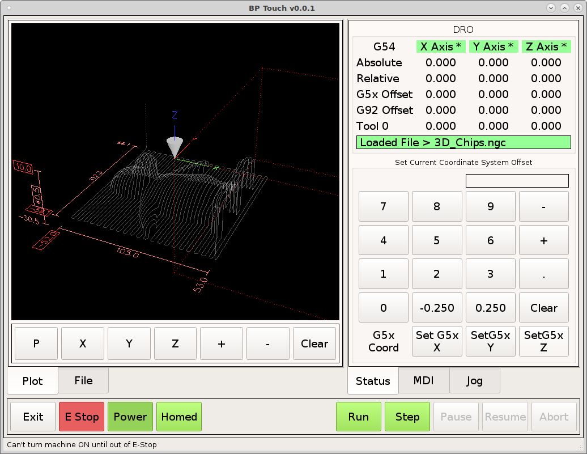
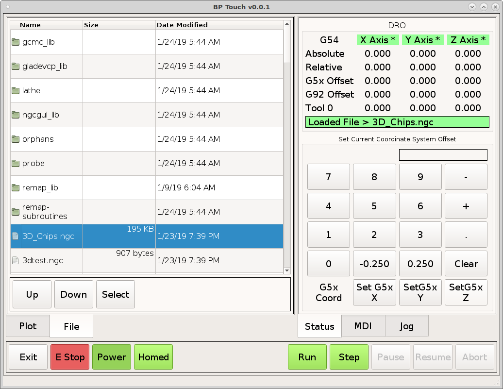
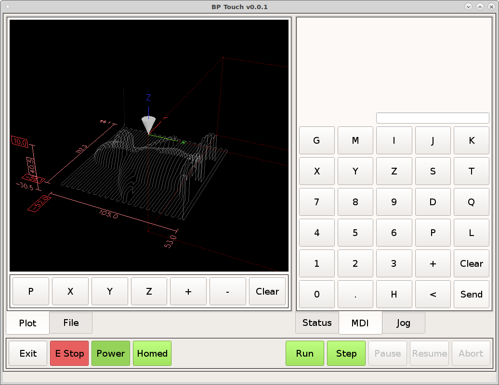
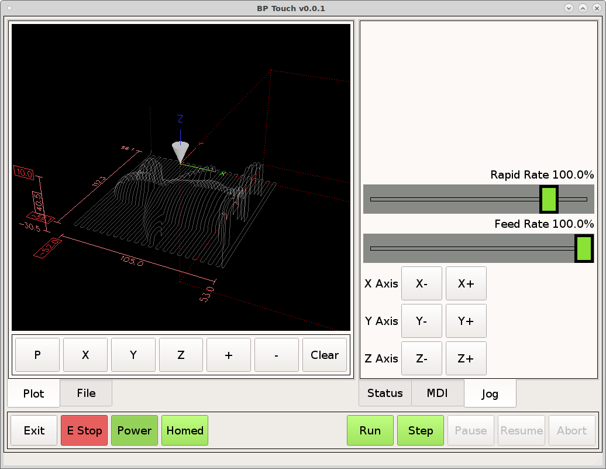

# bp_touch
BP Knee Mill QtPyVCP Touch screen

Requires `QtPyVCP <https://qtpyvcp.kcjengr.com/`_ to be installed and working.

Clone with ``git clone https://github.com/jethornton/bp_touch.git``

To install and be able to edit open a terminal in the bp_touch directory and do
``pip install -e .``

To test with a simulated configuration copy the bp_touch directory from the
configs directory to your linuxcnc/configs directory.

To update just do a ``git pull`` from the bp_touch directory.

Starting to add probe routines, you must copy the subroutine files to a
directory on your LinuxCNC Path. Currently only probe back or Y+ is working.

Main Tab

File Tab

MDI Tab

Jog Tab

